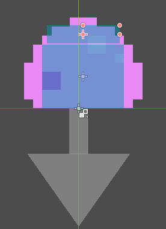
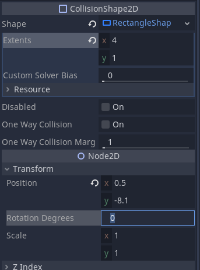
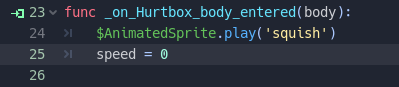
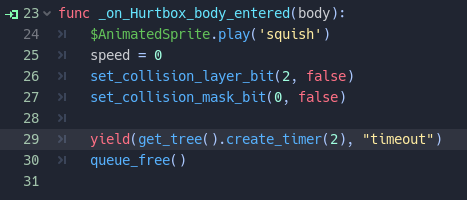
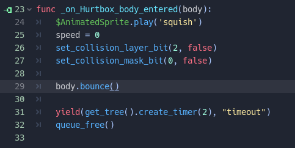
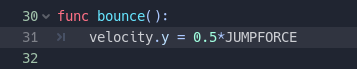

# Hitbox and Hurtbox tutorial

## Assets and Attributions

Character: [Platformer Characters by kenney.nl](https://kenney.nl/assets/platformer-characters)

Terrain and Enemy: [Platformer Art: Pixel Redux by kenney.nl](https://kenney.nl/assets/platformer-art-pixel-redux)

Code borrowed HEAVILY from my following of the BornCG Platforming tutorial, with some structural changes of my own.

## What TODO

Open this game in the Godot Editor.

### Squish the enemies

Open the `PinkSlime` Scene.
You should see the standard moving enemy we've created in class (or at least something similar).

The first thing we're going to do is add a *hurtbox*; this is a collision area that will cause the enemy to take damage if it collides with a foe's *hurtbox*.
To do this, add a new `Area2D` as a child of the PinkSlime; I will name mine `Hurtbox`.
As a child of `Hurtbox`, create a `CollisionShape2D`, with a `RectangleShape2D` as the collision shape, and tweak it so it sits on top of the existing `CollisionShape2D` (which is really just our wall detector) like a hat.

If you want to keep exactly the same size and shape as mine, here are my settings for the transform and the extents of the rectangle shape.
Note that the transform can be on either the `Hurtbox` or the `CollisionShape2D`

We want this to ONLY detect the player, so let's change our Layer settings so that the `Hurtbox` only exists on the Enemy layer, and will interact with the Player Layer.

After setting up the collision shape, select your `Hurtbox`, go to the `Node` panel, and connect the `body_entered` signal to a method in the `PinkSlime.gd` file (the default name is fine).

When the enemy is jumped upon, we want to play the `squish` animation, and set the enemy's speed to 0 (so it stops moving).
This should be old hat, so try it before you look at the next picture

Now when we run the game, we can squish the enemy!  However, we can still make some improvements.

1. The enemy's body sticks around after recoiling into its x eyes pose; it should probably disappear.
1. We can still stand on top of the old Hitbox
1. It would be much more... satisfying if we did a little bounce off the Enemy

Let's address the first two first.  One way to accomplish this is to just set it so we don't exist on a layer and won't interact with the player any more.
Godot offers the `set_collision_layer_bit` and `set_collision_mask_bit` functions, so let's disable the fact that this particular enemy is on the enemy layer (which is bit 2), and disable collision with the player (which is mask bit 0).

Let's also create a timer that makes the body disappear after 2 second, and when it does, we will free this particular enemy.
We can play with the timing of the animation and the disappearance of the enemy later.

Now, how can we do a little... hop off the enemy?
The method takes a parameter: `body`.  This is the object that has entered the collision space.
We can take advantage of "Duck Typing" to call a method that may or may not exist on the entering body.
What we're going to do is call a method on the body, and if the method exists, it will call and the code won't crash!  Duck Typing!
For now, let's call the method `bounce`.  This doesn't exist yet, but we will add it to our player.

If we run the game now, it will crash because the `bounce` method doesn't exist on our `Player`, so let's add it *to the Player script*.

### Play with animation timings and decompose timings

It may benefit us to play with the timings of how fast the enemy recoils and the timing for decompose; have some fun!

### EXPORT YOUR PROJECT AND SUBMIT THE ASSIGNMENT!

This is the minimum working functionality for this assignment/tutorial.  
If you continue with adding a hitbox to the enemy, this minimum functionality MUST still work and be exported as a playable game.

### Turn the tables (if we have time)

Think about how you might add a *hitbox* to the enemy that would injure the player in some way.
How could we reverse this process?  If we have time, we'll play with some ideas in class.
